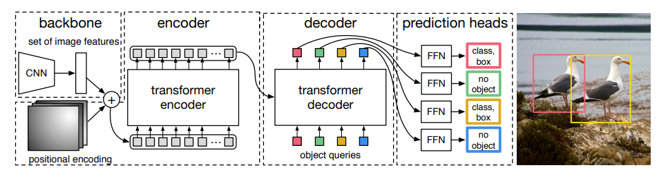

# tiny-detr 🔍

[](https://www.python.org/downloads/)
[](https://opensource.org/licenses/MIT)
[](https://github.com/psf/black)

A lightweight implementation of the DETR (DEtection TRansformer) object detection model, using ResNet-18 as the backbone and a simplified transformer architecture.

<p align="center">
  
</p>

## 🌟 Highlights

- **Lightweight**: Only ~13.9M parameters (compared to original DETR's 41M+)
- **Fast Training**: 2-3x faster training compared to original DETR
- **Simple Architecture**: Perfect for learning and experimentation
- **Multi-Dataset Support**: Works with COCO and PASCAL VOC

## 🏗️ Architecture

| Component | Specification |
|-----------|---------------|
| Backbone | ResNet-18 |
| Transformer Encoder | 2 layers, 4 heads |
| Transformer Decoder | 2 layers, 4 heads |
| Hidden Dimension | 128 |
| Object Queries | 100 |

## 📈 Performance


| Metric | Value |
|--------|--------|
| mAP | 17.40 |
| mAP@50 | 39.14 |
| mAP@75 | 14.02 |

## 🚀 Quick Start

### Installation

```bash
# Clone the repository
git clone https://github.com/ilyasoulk/tiny-detr.git
cd tiny-detr/src/detr

# Create virtual environment (optional but recommended)
python -m venv venv
source venv/bin/activate  # Linux/Mac
# or
.\venv\Scripts\activate  # Windows

# Install dependencies
pip install -r requirements.txt
```

### Training

```bash
python src/detr/train.py
```

### Inference

```bash
python src/detr/inference.py
```

## 📁 Project Structure

```
src/detr/
├── train.py          # Training script
├── inference.py      # Inference and visualization
├── model.py          # Model architecture
├── loss.py          # Bipartite matching loss
├── metrics.py        # mAP calculation
├── engine.py         # Training and evaluation loops
├── dataset.py        # COCO dataset handling
└── dataset_voc.py    # VOC dataset handling
```

## ⚙️ Configuration

```python
config = {
    'backbone': 'resnet18',
    'hidden_dim': 128,
    'num_heads': 4,
    'num_encoder': 2,
    'num_decoder': 2,
    'num_queries': 100,
    'learning_rate': 1e-4,
    'weight_decay': 1e-4
}
```

## 📊 Dataset Support

Supported datasets:
- **COCO**: Full support with automatic download
- **PASCAL VOC**: Full support with automatic download


## 🙏 Acknowledgments

This implementation is inspired by the original DETR paper:
- [End-to-End Object Detection with Transformers](https://arxiv.org/abs/2005.12872)

## 📄 License

This project is licensed under the MIT License - see the [LICENSE](LICENSE) file for details.
